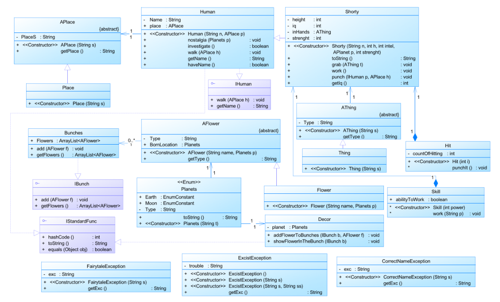

# P_LW3

Реализация сказки по определенному тексту для практики с языком Java:

> Коротышки молча принялись за работу.  Фикс  ткнул  Незнайку  в  спину метлой, и они отправились дальше.  Поднявшись  на  холм,  Незнайка  увидел красивый двухэтажный дом с большой открытой  верандой.  Вокруг  дома  были разбиты клумбы с цветами.  Здесь  были  и  лунные  маргаритки,  и  анютины глазки, и настурции, и лунная резеда, и астры. Под окнами дома росли кусты лунной сирени. Все эти цветы были такие же, как и у нас на  Земле,  только во много раз мельче. Впрочем, Незнайка уже начал привыкать к тому, что  на Луне растения маленькие, и это уже не удивляло его.
